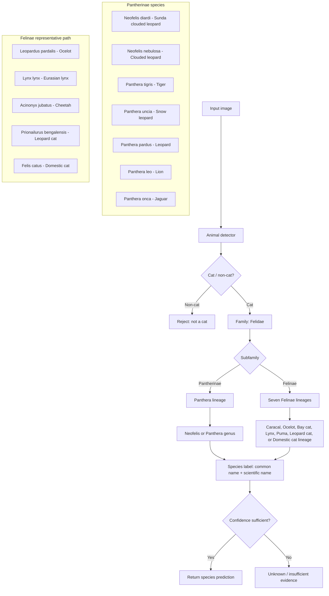

# Felidae classification flowchart

The classifier follows the taxonomic path below. The final label always contains both the common name and the scientific name.

The complete species list, including every genus and lineage, is in `felidae_species.json` and is rendered by `app.py`.
